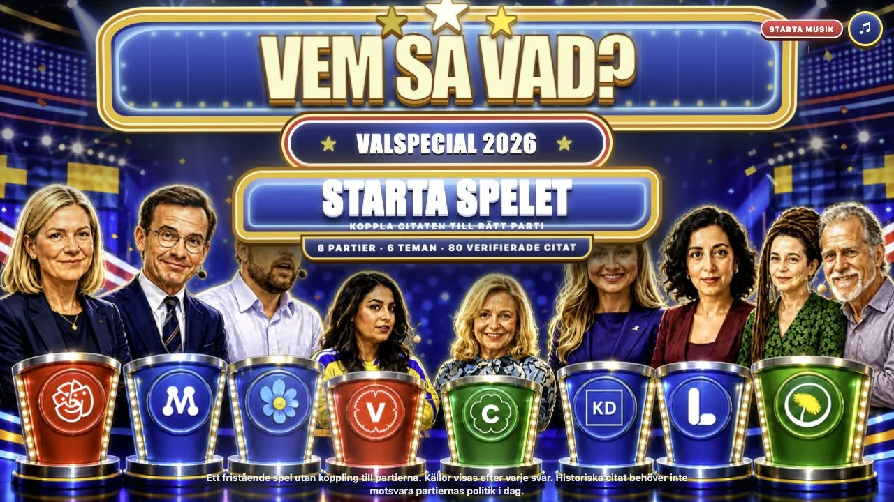
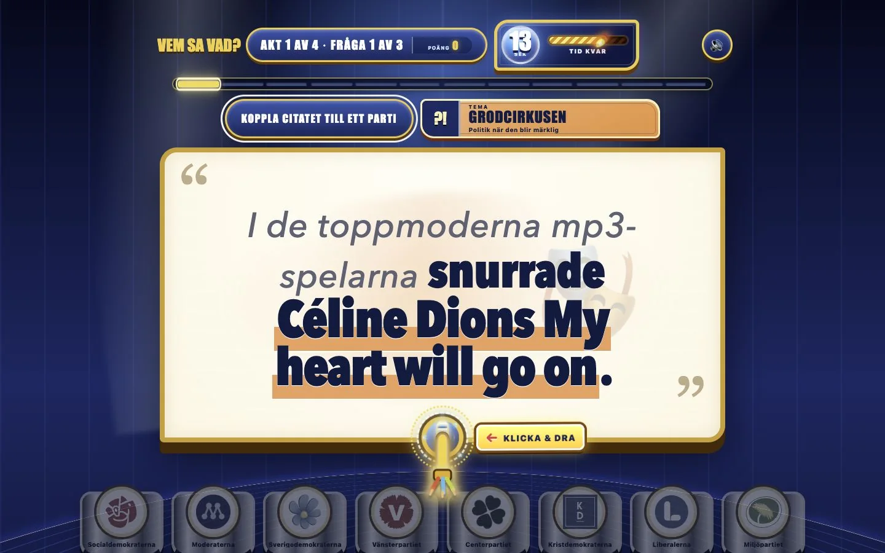
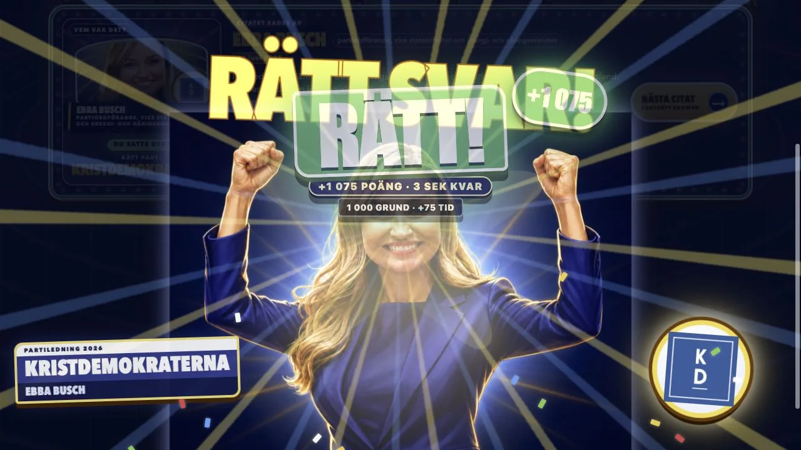

# Vem sa vad? ⚡

## Valspecial 2026

**Sveriges mest överproducerade politikquiz.** Koppla autentiska svenska politiska citat till partiet bakom orden – innan tiden, publiken och den sprakande kabeln hinner före dig.

[**Spela Vem sa vad? →**](https://vem-sa-vad-valspecial-2026.jawbreakerz.chatgpt.site/)

> 24 frågor per runda · 8 partier · 6 teman · 20 sekunder per citat



| Koppla citatet | Ta konsekvenserna |
| --- | --- |
|  |  |
| Dra kabeln till det parti du tror står bakom orden. | Rätt svar ger fanfar. Fel svar ger buzzer – och källan visas alltid. |

## Så fungerar spelet

1. Läs citatet och frågans tema.
2. Dra den strömförande kabeln till ett av de åtta partipodierna – eller tryck direkt på ett parti.
3. Svara innan den 20 sekunder långa stubinen brinner ut.
4. Se vem som faktiskt sade det, när det sades och i vilket sammanhang.
5. Bygg svarssviter, samla tidsbonus och dela slutpoängen.

En runda innehåller tre citat från varje parti. Urvalet viktas mot de mest kända, roliga, oväntade och förrädiskt formulerade citaten.

## Sex sorters politisk cirkus

- **Klassikern** – citatet som fastnade.
- **Grodcirkusen** – politik när den blir märklig.
- **Det där åldrades… sådär** – originalet möter vad som faktiskt hände senare.
- **Partimaskeraden** – när orden låter som fel parti.
- **Duellen** – repliken som träffade tillbaka.
- **Ordbilden** – politik målad med stora penslar.

## Citatbanken

Spelet innehåller just nu **84 citat**, varav **80 är verifierade och spelbara**. Fyra ligger kvar i granskningskö och kan inte väljas till en runda.

Tidsperioden är 1994–2026. Partiledare, statsministrar och språkrör prioriteras; andra officiella företrädare används bara när formuleringen är ovanligt stark.

Historiska citat behöver inte motsvara partiets politik i dag. Poängen är inte att tala om vad spelaren ska tycka – utan att utmana föreställningen om vem som låter som vem.

## Källor och verifiering

Ett citat blir spelbart först när följande har kontrollerats:

- exakt ordalydelse,
- talare och officiell roll,
- datum och omedelbart sammanhang,
- primärkälla eller originalupptagning,
- exakt hänvisning till anförande, tidskod eller avsnitt.

Efter varje svar visas talare, datum, sammanhang och en direktlänk till citatets källa. Temat **Det där åldrades… sådär** kräver dessutom en separat källa som belägger den senare händelsen. Spelet påstår aldrig att någon ”ångrar” ett uttalande om det inte finns belägg för just det.

Hela modellen finns i [det redaktionella arbetsflödet](content/EDITORIAL_WORKFLOW.md).

## Köra lokalt

Kräver Node.js 22.13 eller senare.

```bash
npm ci
npm run dev
```

Öppna sedan [http://localhost:3000](http://localhost:3000).

Kör hela den lokala kvalitetskontrollen med:

```bash
npm run check
```

Kontroller som hämtar externa originalkällor körs separat:

```bash
npm run check:quote-links
npm run check:quote-wording
```

## Teknik

Next.js 16, React 19, TypeScript, Vinext/Vite och Web Audio API. Gränssnittet är byggt för mus, touch och tangentbord.

## Bild-, ljud- och varumärkesmaterial

Partilogotyperna kommer från partiernas officiella press- eller profilmaterial och kan omfattas av varumärkesrätt. Scenbilder och karikatyrer är AI-genererade; visst identitets- och källmaterial behöver ytterligare rättighetsklarering före bred offentlig eller kommersiell användning.

Källor och aktuell rättighetsstatus dokumenteras i [`content/asset-rights.json`](content/asset-rights.json).
